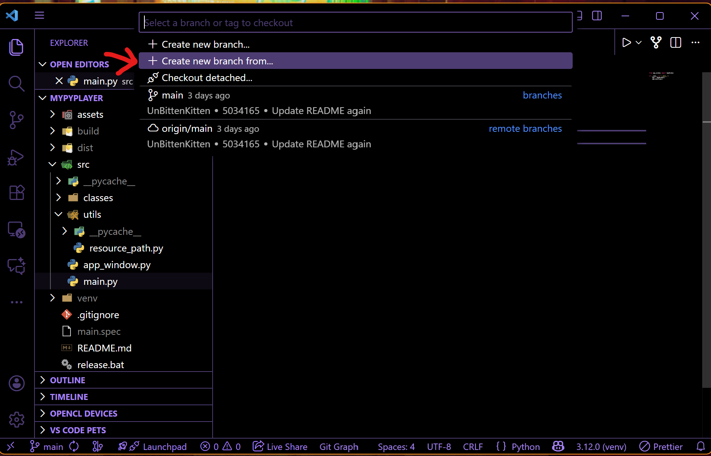
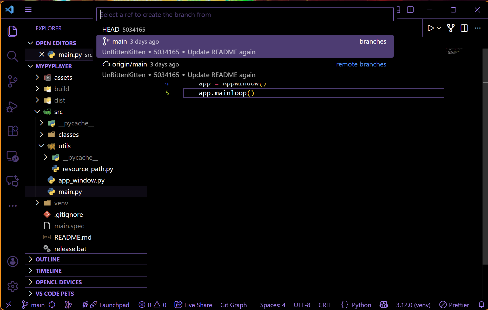
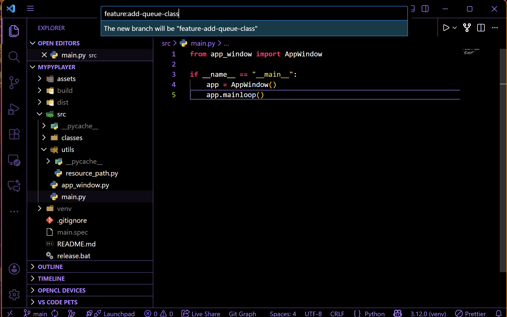
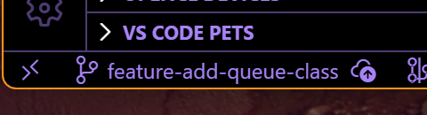
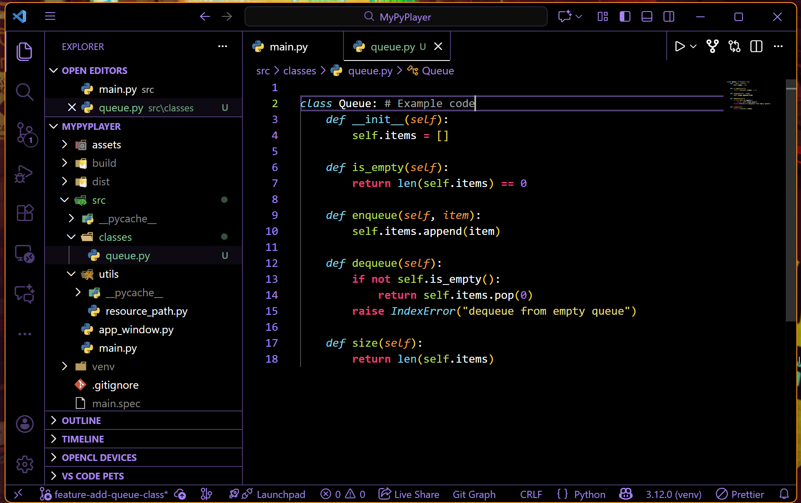
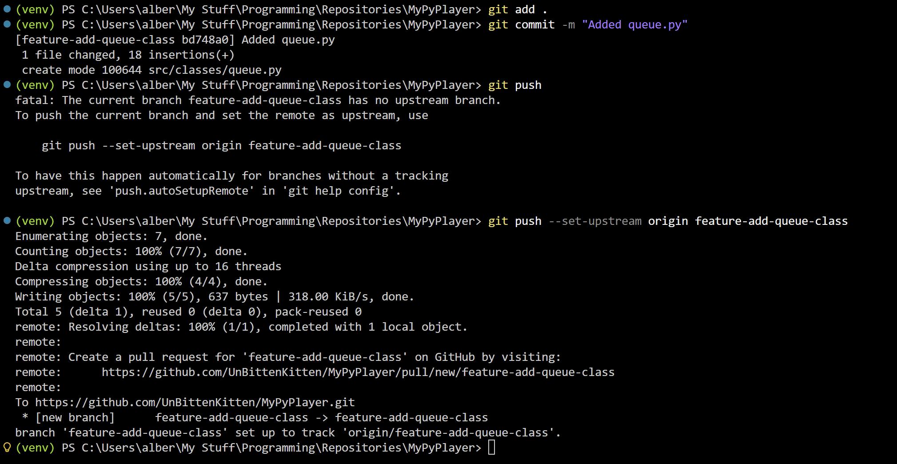
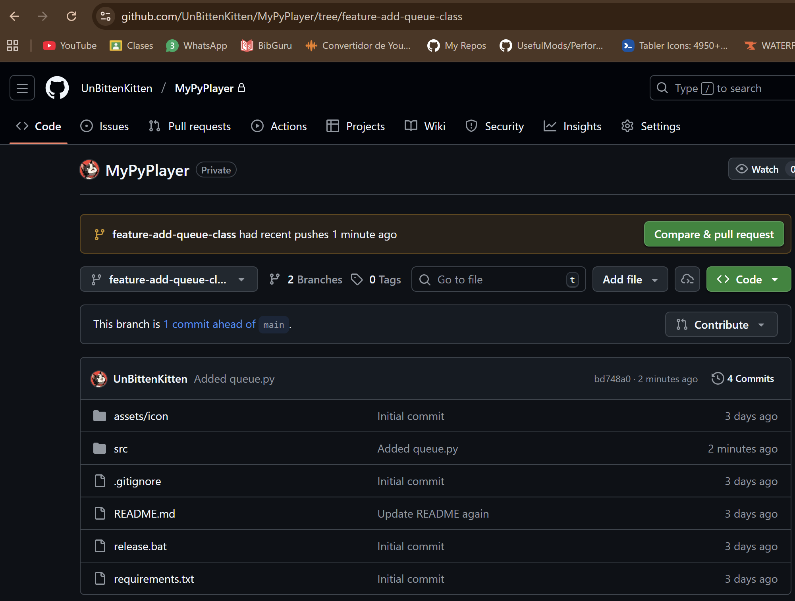
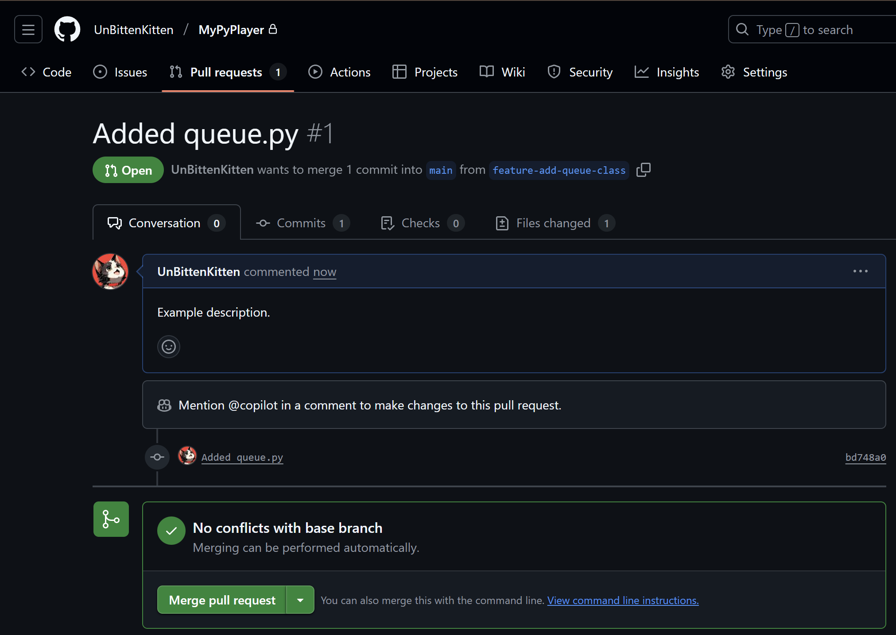

# How to Create a Pull Request

## 1. Create and Name a New Branch

First, you need a new branch for your changes. In your code editor, click on your current branch name (e.g., "main") in the bottom-left corner.

From the menu that appears, select the option to create a new branch. Make sure you are branching off of `main`.

Now, give your branch a descriptive name. A good convention is `feature/` or `fix/` followed by a short description.
For example: `fix/play-button-bug`.

---

## 2. Make Your Changes

With your new branch checked out, you can now safely make your code changes. Add, edit, and delete files as needed to implement your feature or fix.

---

## 3. Commit and Push Your Branch

Once you are happy with your changes, commit them with a clear message. After committing, push your new branch up to the remote repository (e.g., GitHub).

> **Note:** If Git prompts you about setting an "upstream" branch, just follow the instructions it provides in the terminal or your editor. This is usually a one-time command to link your local branch to the remote one.

---

## 4. Open the Pull Request on GitHub

Go to your repository's main page on GitHub. You should see a yellow banner appear for your recently pushed branch. Click the **"Compare & pull request"** button.

---

## 5. Fill Out the Pull Request Form

Give your pull request a clear title and write a description of the changes you made. This helps your teammates understand what you did and why. When you're ready, click **"Create pull request."**

---

## 6. Done!

That's it! Your pull request is now open. Your team can review your changes, leave comments, and, once it's approved, merge your code into the `main` branch.

